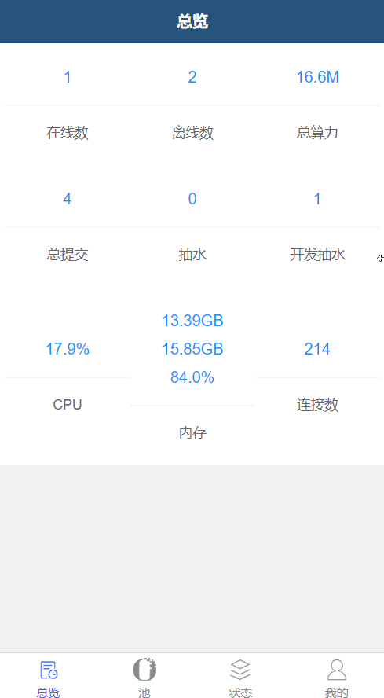

# vtMinerProxy


# minerProxy



## Liunx一键工具 


```bash
bash <(curl -s -L https://raw.githubusercontent.com/victorMinerProxy/vtMinerProxy/master/scripts/tools.sh)
```

### 运行情况
```bash
screen -r minerProxy
```
### 退出查看运行情况 键盘键入
```
ctrl + a + d
```

---
## Linux手动安装
```bash
mkdir miner_proxy
cd miner_proxy

# x86服务器
wget https://raw.githubusercontent.com/Char1esOrz/minerProxy/master/release/v5.3.0/minerProxy_v5.3.0_linux_amd64
chmod 777 minerProxy_v5.3.0_linux_amd64
./minerProxy_v5.3.0_linux_amd64


# arm服务器
wget https://raw.githubusercontent.com/Char1esOrz/minerProxy/master/release/v5.3.0/minerProxy_v5.3.0_linux_arm64
chmod 777 minerProxy_v5.3.0_linux_arm64
./minerProxy_v5.3.0_linux_arm64
```

### 后台运行（注意后面的&）运行完再敲几下回车

```bash
nohup ./minerProxy_v5.3.0_linux_amd64 &
# 运行之后查看webtoken
tail -f nohup.out
```

### 后台运行时关闭

```bash
killall minerProxy
```
### 后台运行时查看
```bash
tail -f nohup.out
```
## 重要说明

```bigquery
开发者费用
本软件如果您开启了抽水则为0.3%的开发者费用,如果您不开启抽水,则没有开发者费用,可以自行抓包查看


推荐使用腾讯云香港节点,flexpool和ethermine都可以到50ms左右,延迟率在0.5%-0.9%之间
该软件系统占用极小,开最便宜的云服务器即可（不要使用轻量服务器,轻量网络极差）
```
<a href="https://t.me/minerProxyGroup">tg 交流群</a></br>
<a href="https://qm.qq.com/cgi-bin/qm/qr?k=e0Vr0j34bix_1F6ZM15cOomnz3xNamlM&jump_from=webapi">QQ交流群 (゜-゜)つロ 干杯</a></br>
</img>


